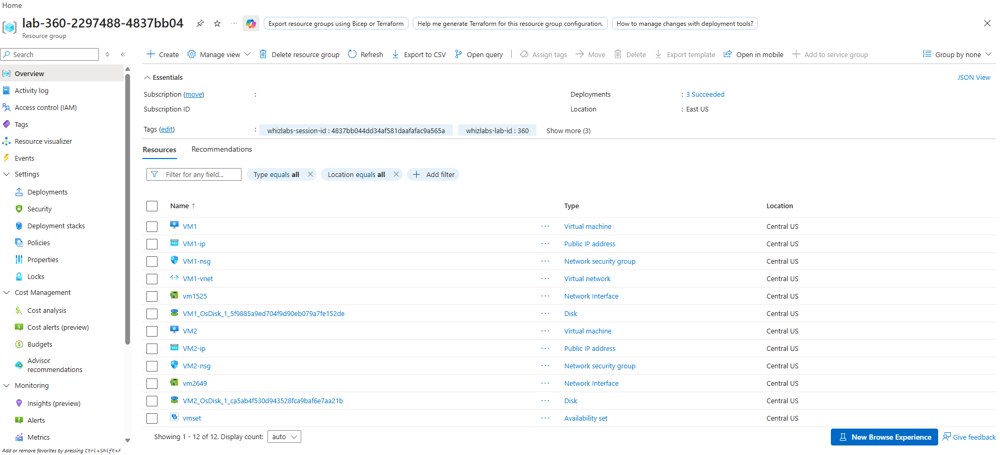
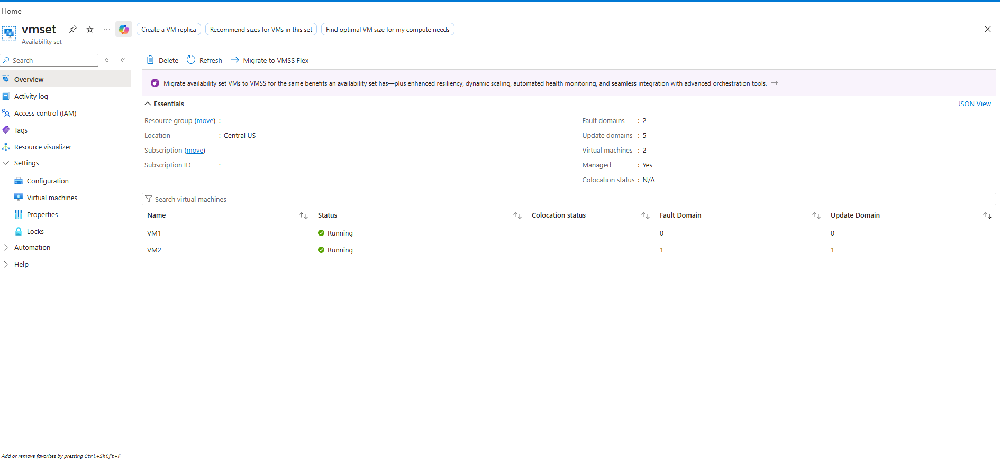
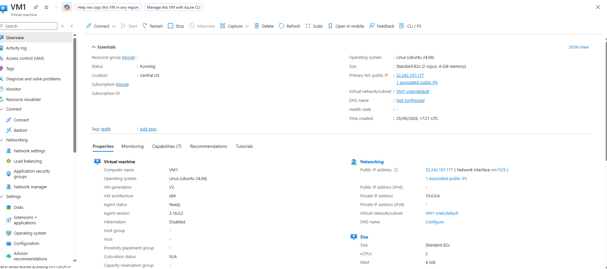
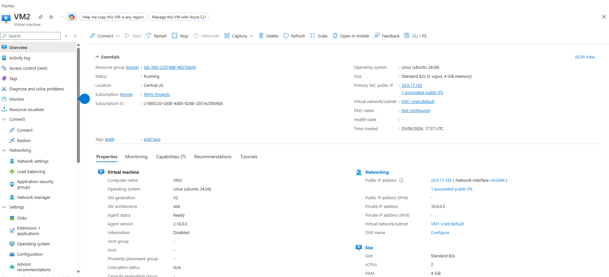

# Azure High Availability: Deploying VMs in an Availability Set

This project demonstrates how to configure high availability for compute workloads in Microsoft Azure by deploying multiple Linux Virtual Machines into a dedicated Availability Set. Distributing VMs across separate Fault Domains and Update Domains ensures workloads remain resilient against unplanned hardware faults and planned maintenance cycles.

---

## Architecture Overview

                  +-------------------------------------------------+
                  |              Virtual Network: VM1-vnet          |
                  |                     (10.0.0.0/16)               |
                  |                                                 |
                  |  +-------------------------------------------+  |
                  |  |             Subnet: default               |  |
                  |  |              (10.0.0.0/24)                |  |
                  |  |                                           |  |
                  |  |      +-----------------------------+      |  |
                  |  |      |   Availability Set: vmset   |      |  |
                  |  |      |  (2 Fault / 5 Update Doms)  |      |  |
                  |  |      |                             |      |  |
[ Internet ]          |  |      |   +---------------------+   |      |  |
|                |  |      |   |        VM1          |   |      |  |
+--- [VM1-ip] ---+--+------+-->|  - Fault Domain: 0  |   |      |  |
|    (Public)    |  | [VM1-nsg]|  - Update Domain: 0 |   |      |  |
|                |  |  (SSH)   |  - IP: 10.0.0.4     |   |      |  |
|                |  |      |   +---------------------+   |      |  |
|                |  |      |                             |      |  |
|                |  |      |   +---------------------+   |      |  |
|                |  |      |   |        VM2          |   |      |  |
+--- [VM2-ip] ---+--+------+-->|  - Fault Domain: 1  |   |      |  |
(Public)    |  | [VM2-nsg]|  - Update Domain: 1 |   |      |  |
|  |  (SSH)   |  - IP: 10.0.0.5     |   |      |  |
|  |      |   +---------------------+   |      |  |
|  |      +-----------------------------+      |  |
|  +-------------------------------------------+  |
+-------------------------------------------------+

---

## Deployed Resources

| Resource Name | Type | Key Configuration | Purpose / Notes |
| :--- | :--- | :--- | :--- |
| **vmset** | `Microsoft.Compute/availabilitySets` | 2 Fault Domains, 5 Update Domains, Aligned | Logical grouping to isolate hardware failures |
| **VM1** | `Microsoft.Compute/virtualMachines` | Standard B2s (2 vCPU, 4 GiB), Ubuntu 24.04 | Workload Node 1 (FD: 0, UD: 0) |
| **VM2** | `Microsoft.Compute/virtualMachines` | Standard B2s (2 vCPU, 4 GiB), Ubuntu 24.04 | Workload Node 2 (FD: 1, UD: 1) |
| **VM1-vnet** | `Microsoft.Network/virtualNetworks` | CIDR `10.0.0.0/16`, Subnet `10.0.0.0/24` | Core Virtual Network |
| **vm1525** | `Microsoft.Network/networkInterfaces` | Dynamic Private IP `10.0.0.4` | Primary NIC for VM1 |
| **vm2649** | `Microsoft.Network/networkInterfaces` | Dynamic Private IP `10.0.0.5` | Primary NIC for VM2 |
| **VM1-ip** | `Microsoft.Network/publicIPAddresses` | Standard SKU, Static IPv4 (`52.242.197.177`) | Management Ingress for VM1 |
| **VM2-ip** | `Microsoft.Network/publicIPAddresses` | Standard SKU, Static IPv4 (`20.9.17.183`) | Management Ingress for VM2 |
| **VM1-nsg** / **VM2-nsg** | `Microsoft.Network/networkSecurityGroups` | Inbound Port 22 (TCP Allow, Priority 300) | Restricts inbound traffic to SSH only |

---

## Lab Implementation & Verification

### 1. Resource Group Inventory
All underlying compute, network interfaces, virtual network, and security groups were provisioned inside the target region:

### 2. Availability Set Distribution
The availability set (`vmset`) ensures separation across independent physical racks (Fault Domains) and scheduled host updates (Update Domains):
* **VM1**: Fault Domain `0`, Update Domain `0`
* **VM2**: Fault Domain `1`, Update Domain `1`

### 3. Virtual Machine Provisioning

#### VM1 Configuration
* **Status:** Running
* **Private IP:** `10.0.0.4`
* **Public IP:** `52.242.197.177`
* **Network Interface:** `vm1525`

#### VM2 Configuration
* **Status:** Running
* **Private IP:** `10.0.0.5`
* **Public IP:** `20.9.17.183`
* **Network Interface:** `vm2649`

